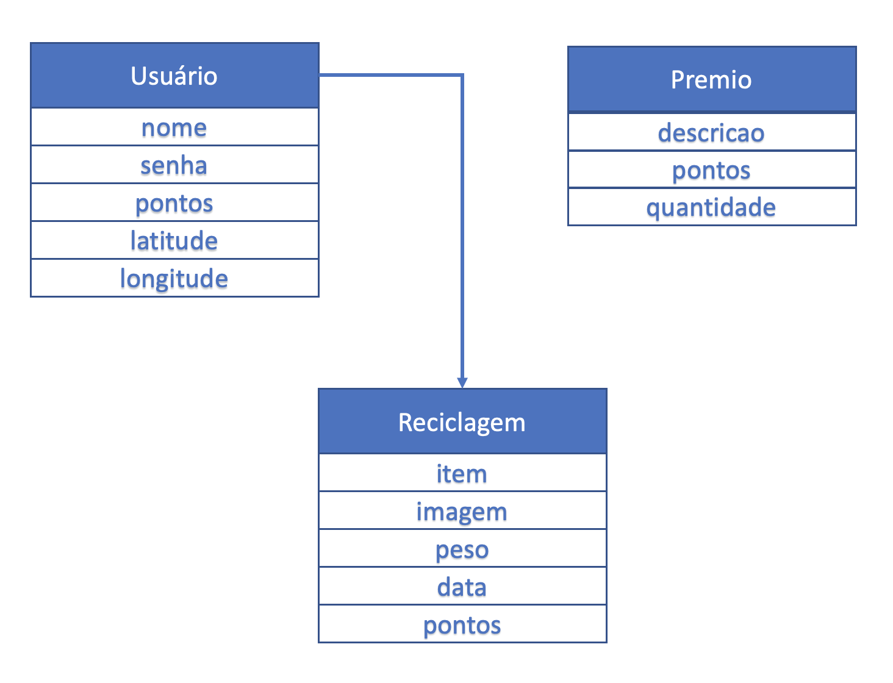

## Fullstack - Trabalho 01 - Camada de Persistência

A prefeitura de Cidade Verde decidiu lançar uma campanha para incentivar a reciclagem de material produzido pelas residências.

Para isso solicitou o desenvolvimento de uma plataforma para que os moradores da cidade possam receber pontos pelos itens corretamente separados para a reciclagem.

A cada quantidade de material reciclado são atribuídos pontos que podem ser trocados mensalmente por prêmios como pintura de muro, desconto no IPTU, etc...

## Entrega

- O trabalho deve ser individual

- Efetuar a entrega por meio do canvas enviando **APENAS** os arquivos **.js** ou URL para repositório **git**

### Modelo de Dados

- Construir a camada de persistência baseada em `mongoose` baseada no modelo abaixo:

- Implementar funções para Criação, Atualização, Recuperação e Exclusão (CRUD) para cada objeto do diagrama acima
- Na função de Criação retornar o objeto recém criado
- A função de recuperação deve obter um objeto por meio de seu `_id`
- A função de Atualização e Exclusão devem realizar a operação pelo `_id` do objeto verificando se o objeto existe (pelo `_id` informado) antes de atualizar ou excluir